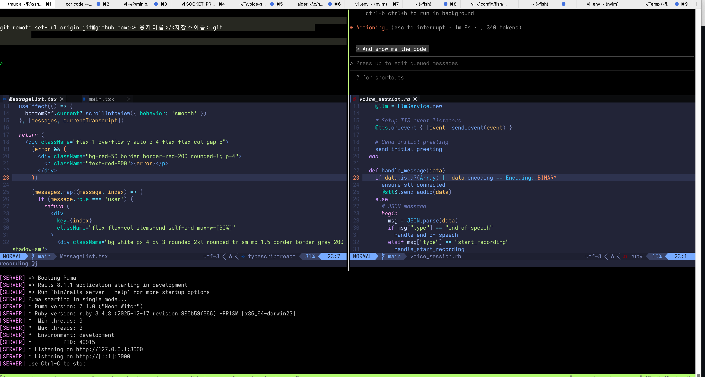
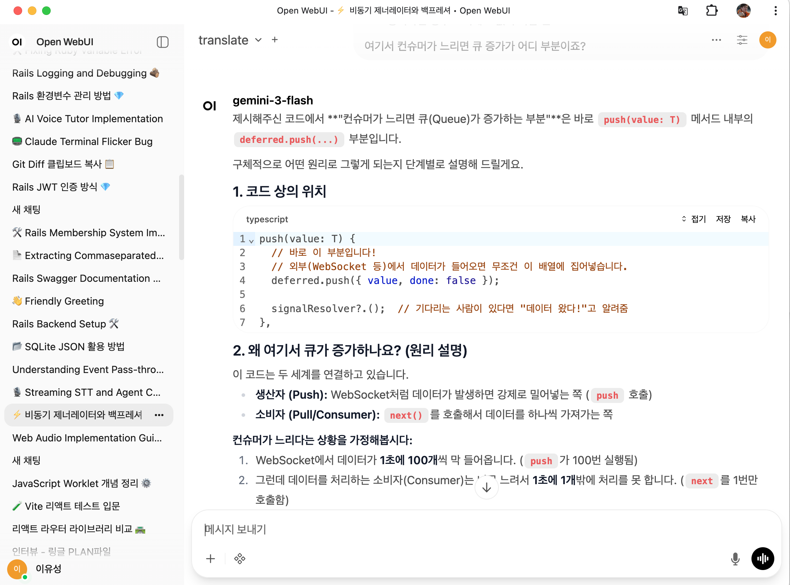

Aider, Claude Code, Open WebUI.
Aider 같은 경우는 다양한 모델과 원하는 파일만을 포함하여 정확하게 요청 할 수 있습니다.
Claude Code는 다량의 코드를 한번에 수정하거나 기능이 아닌 프로젝트 관점에서 계획이 필요할 때 사용합니다.
둘 모두 구현하려는 요구사항을 입력하고 저와 생각하는 것을 일치시키거나 디벨롭 한 후 코드 수정을 요청합니다. 

계획 수립은 Open WebUI에서 여러 모델과 교차 검증하며 디벨롭하는 경우도 있습니다.
광범위한 검색과 정리나 강력한 모델을 사용할 때 외에는 Open WebUI에서 작업합니다.
Open WebUI는 공식 웹UI보다 여러 단축키와 노트, 커스텀 도구들이 많아 이 쪽을 주로 사용합니다.

